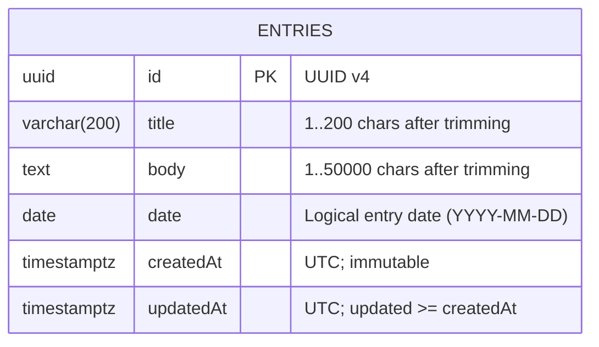

# Daylog — Minimal ERD and Glossary

## ERD (entries)

**Notes**
- `id` — primary key (UUID v4).
- `title` — validated per ENTRY-BR-1 (trim → length 1..200).
- `body` — validated per ENTRY-BR-2 (trim → length 1..50000).
- `date` — logical entry date, not tied to timestamps; strict calendar date.
- `createdAt`/`updatedAt` — UTC timestamps; invariants from BR-2 (`updatedAt >= createdAt`).
- Recommended indexes:
  - `idx_entries_date` on `(date)` for filtering and default sort (`date DESC`).
  - `idx_entries_createdAt` on `(createdAt)`.
  - `idx_entries_updatedAt` on `(updatedAt)`.
  - Optional: full-text index on `title, body` or a trigram index for substring search if the DB supports it.

---

## Glossary

- **Entry** — domain entity representing a diary note with fields: `id`, `title`, `body`, `date`, `createdAt`, `updatedAt`.
- **Use Case (UC)** — an application-level operation describing user intent and observable effects. In Daylog v1:
  - **UC-1 Add Entry** — create a new entry.
  - **UC-2 List Entries** — paginate and filter entries.
  - **UC-3 Get Entry** — fetch a single entry by `id`.
  - **UC-4 Delete Entry** — remove an entry by `id`.
  - **UC-5 Update Entry** — change `title`, `body`, `date` of an entry.
- **Business Rules (BR)** — see `BUSINESS_RULES.md`
- **Entry Business Rules (ENTRY-BR)** — see `ENTRY_RULES.md`
- **DTO (Data Transfer Object)** — immutable data structure used to pass request/response data across layers (e.g., `AddEntryRequest`, `ListEntriesResponse`).
- **Validator** — component enforcing BR/ENTRY-BR on DTOs; transport validators live in Presentation; domain validators live in Application.
- **Provider** — composition root for a specific UC wiring dependencies (repositories, services) from configuration to a ready-to-use interactor.
- **Repository** — abstraction over persistence for domain entities (backed by storage layer and models).
- **Storage** — low-level CRUD API tightly coupled to the underlying DB/ORM; used by repositories.
- **Sanitizer/Normalizer** — Presentation-level adapters that trim, coerce and validate transport inputs before DTO construction.
- **Clock** — domain service providing deterministic time for BR-2 invariants and testability.
- **Id Generator / UUID** — domain service for creating UUID v4 identifiers; shared helper for strict UUID validation in tests/presentation.
- **Acceptance Criteria (AC)** — executable behavioral constraints per UC, mirrored by tests (happy path + error/alternative flows).
- **TDD Cycle** — Red → Green → Refactor; one step per commit with conventional messages.